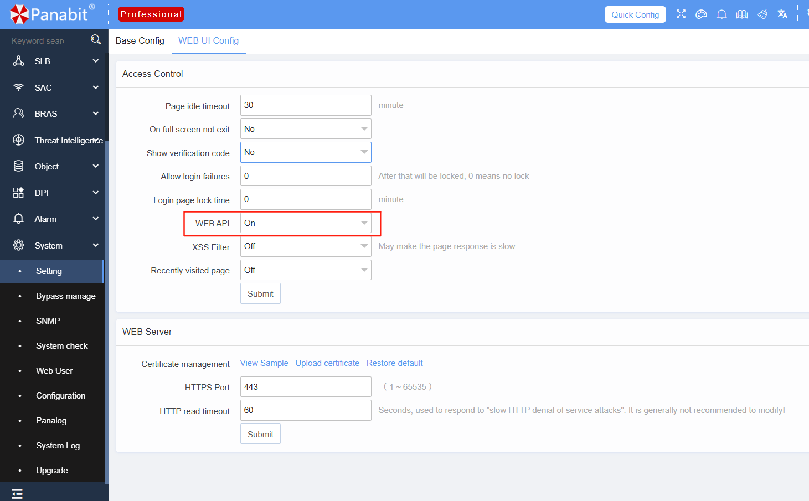
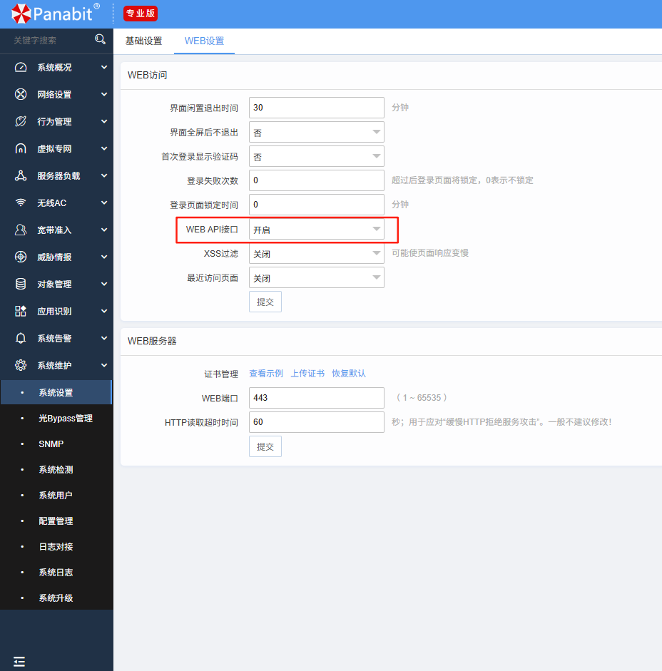

# Interface Traffic Export Script (Prometheus Format)  
# 接口流量采集脚本（Prometheus 格式）

## Overview |简介
This is a lightweight PHP script that retrieves upstream and downstream interface traffic (in bps) from the Panabit Intelligent Gateway using its RESTful API. The collected data is exported in a Prometheus-compatible text format for scraping.  
这是一个轻量级的 PHP 脚本工具，基于 Panabit 智能应用网关的 RESTful API，定时获取指定接口的上下行速率（bps），并以 Prometheus 兼容格式输出到文本文件，供Prometheus采集使用。

## 🧰 Use Cases |使用场景 

- Integrate Panabit device metrics into a centralized Prometheus monitoring system
- 将 Panabit 设备状态数据接入统一的 Prometheus 监控体系 
- Visualize and alert on traffic usage of key interfaces
- 实现关键接口流量的可视化与告警 
- Collect operational metrics using standard tools without complex development  
- 使用标准工具采集设备运行指标，无需复杂开发

## 🔁 Script Features |脚本功能 
- Automatically logs into the Panabit gateway via RESTful API to obtain an access token
- 通过 RESTful API 自动登录 Panabit 网关并获取 token  
- Polls interface data every 5 seconds
- 每 5 秒轮询一次设备状态 
- Retrieves interface bandwidth usage (in bps)
- 获取接口的上下行速率（单位：bps）  
- Outputs data in Prometheus `textfile` format
- 将数据输出为 Prometheus `textfile` 格式 
- Compatible with `node_exporter`'s `textfile` collector  
- 可配合 `node_exporter` 的 `textfile` 模块使用

## 📦 Script File  |脚本位置
- [`panabit_flow_export.php`](panabit_flow_export.php)  


## 🔐Enabling Panabit API Service (Prerequisite) | 启用 Panabit API 服务（前置条件）

The scripts rely on Panabit's RESTful API. Please make sure the API service is enabled on the device:  
脚本使用 Panabit 的 RESTful API 接口，需确保设备已开启 API 服务：

1. Log in to the device's Web UI → System Maintenance → System Settings → Web Settings  
   登录设备 WEB UI → 系统维护 → 系统设置 → WEB设置  

2. Enable the "WEB API Interface" option  
   选择开启 “WEB API接口”




## ⚙ Usage  |使用方法
### 1. Edit Configuration  |修改配置项
Open the script and modify the following 5 parameters at the top:  
打开脚本文件，修改顶部的以下 5 个配置项：

```php
$ip = "panabitipmgt";         // IP address of the Panabit management interface  
$username = "user";           // Login username  
$password = "pwd";            // Login password  
$file = "path for metrics";   // Output file path for Prometheus scraping  
$int = "interface";           // Name of the interface to monitor  
```

### 2. Run the Script  |启动脚本
Ensure PHP is installed (with curl extension enabled), then run:  
确保系统已安装 PHP（并启用了 curl 模块），然后运行：

```bash
php panabit_flow_export.php
```

The script will run continuously and update every 5 seconds.  
脚本将持续运行，并每 5 秒更新一次数据。

## 🔗 Prometheus Configuration  |Prometheus 采集建议配置
Use with `node_exporter`'s `textfile` module. Example:  
推荐结合 `node_exporter` 的 `textfile` 模块使用。示例如下：

**Start `node_exporter` with:**  
**启动  `node_exporter`  添加参数：**

```bash
--collector.textfile.directory=/tmp
```

**Prometheus job configuration:**  
**Prometheus job 配置示例：**

```yaml
- job_name: 'panabit-metrics'
  static_configs:
    - targets: ['your_node_exporter_host:9100']
```

For more details, see: https://github.com/prometheus  
更多部署配置说明可参考：https://github.com/prometheus

## 📝 Output Format |输出指标格式 
The output file will follow standard Prometheus format:  
输出文件为标准 Prometheus 指标格式：

```
panabit_out 123456  
panabit_in 234567
```

## 🚧 Notes  |注意事项
- Interface name must match actual device configuration
- 接口名称需与设备配置一致  
- Ensure API user has sufficient permissions
- API 用户需具备足够权限 
- For background operation, consider using `systemd` or `supervisord`
- 建议结合 `systemd` 或 `supervisor` 进行守护进程管理
- If the interface is invalid or missing, output values may be empty  
- 若接口名称无效或未配置，输出可能为空

## 📣 Contribution & Feedback  |贡献与反馈
Feel free to use, modify, or extend this script. Issues and suggestions are welcome!  
欢迎使用、修改、二次开发本脚本。如有问题欢迎提交 Issue。  
More Panabit API examples will be released soon—stay tuned!  
更多 Panabit API 示例脚本将陆续开放，欢迎关注本项目。
